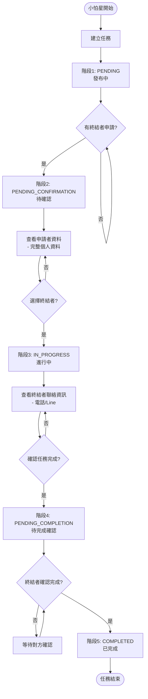
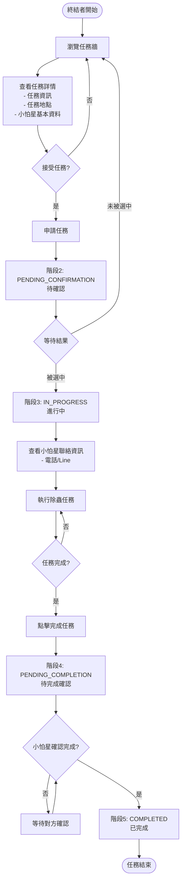
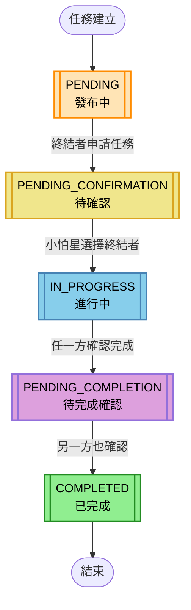

# Bug 119 角色流程圖

## 小怕星 (Fear Star) 任務流程

## 蟲蟲終結者 (Terminator) 任務流程

## 重要權限控制

### 聯絡資訊可見性
- **PENDING**: 雙方都看不到對方聯絡資訊
- **PENDING_CONFIRMATION**: 雙方都看不到對方聯絡資訊
- **IN_PROGRESS**: 雙方都能看到完整聯絡資訊（電話/Line）
- **COMPLETED**: 聯絡資訊自動隱藏

### 個人資料可見性
- **PENDING**: 終結者只能看到小怕星基本資料
- **PENDING_CONFIRMATION**: 小怕星可查看申請者完整個人資料
- **IN_PROGRESS**: 雙方都能查看對方完整聯絡資訊
- **COMPLETED**: 恢復基本資料可見性

### 操作權限
- **小怕星**: 
  - 在 PENDING_CONFIRMATION 狀態可選擇終結者
  - 在 IN_PROGRESS 狀態可確認任務完成
- **終結者**: 
  - 在 PENDING 狀態可申請任務
  - 在 IN_PROGRESS 狀態可確認任務完成

### 完成確認機制
- 任務完成需要雙方都確認
- 任一方確認後，需等待對方也確認
- 只有雙方都確認後，任務才正式完成 (COMPLETED)

## 任務狀態變化流程圖

### 狀態說明

1. **PENDING（發布中）**
   - 初始狀態，任務剛被小怕星建立
   - 終結者可以申請任務

2. **PENDING_CONFIRMATION（待確認）**
   - 有終結者申請後進入此狀態
   - 小怕星可以選擇終結者

3. **IN_PROGRESS（進行中）**
   - 小怕星選擇終結者後進入此狀態
   - 雙方都可以確認任務完成

4. **PENDING_COMPLETION（待完成確認）**
   - 一方確認完成後進入此狀態
   - 等待另一方也確認完成

5. **COMPLETED（已完成）**
   - 雙方都確認完成後的最終狀態
   - 任務正式結束

