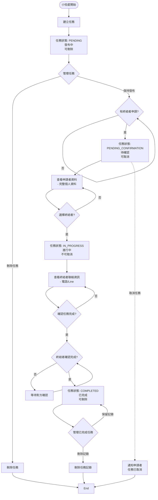
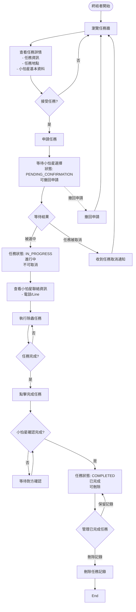

# Bug 119 角色流程圖

## 小怕星 (Fear Star) 任務流程

## 蟲蟲終結者 (Terminator) 任務流程

## 狀態轉換關鍵點說明

### 小怕星視角

1. **建立任務 (PENDING)**
   - 發布任務詳情並設定相關資訊
   - 任務進入發布中狀態
   - 只能刪除任務，不可編輯
   - 等待終結者申請任務

2. **待確認狀態 (PENDING_CONFIRMATION)**
   - 有終結者申請後進入此狀態
   - 查看申請者完整個人資料
   - 可以取消任務（會通知所有申請者）
   - 決定是否選擇該終結者

3. **任務進行 (IN_PROGRESS)**
   - 選擇終結者後任務開始執行
   - 不可取消任務
   - 可查看終結者聯絡資訊（電話/Line）
   - 等待任務完成並進行確認

4. **等待確認完成**
   - 小怕星確認任務完成後
   - 等待終結者也確認完成
   - 雙方都確認後進入完成狀態

5. **任務完成 (COMPLETED)**
   - 雙方都確認完成
   - 可刪除任務記錄
   - 任務正式結束

### 蟲蟲終結者視角

1. **瀏覽任務**
   - 在任務牆瀏覽可申請的任務
   - 查看任務詳情、任務地點、小怕星基本資料
   - 決定是否申請任務

2. **申請等待 (PENDING_CONFIRMATION)**
   - 申請任務後等待小怕星選擇
   - 可選擇撤回申請
   - 等待結果：被選中或任務被取消

3. **處理等待結果**
   - **被選中**：進入任務執行階段
   - **任務被取消**：收到取消通知並返回瀏覽任務

4. **執行任務 (IN_PROGRESS)**
   - 被選中後任務開始
   - 不可取消任務
   - 可查看小怕星聯絡資訊（電話/Line）
   - 執行除蟲任務並點擊完成

5. **等待確認完成**
   - 終結者確認完成後
   - 等待小怕星也確認完成
   - 雙方都確認後進入完成狀態

6. **任務完成 (COMPLETED)**
   - 雙方都確認完成
   - 可刪除任務記錄
   - 任務正式結束

## 重要權限控制

### 聯絡資訊可見性
- **PENDING**: 雙方都看不到對方聯絡資訊
- **PENDING_CONFIRMATION**: 雙方都看不到對方聯絡資訊
- **IN_PROGRESS**: 雙方都能看到完整聯絡資訊（電話/Line）
- **COMPLETED**: 聯絡資訊自動隱藏

### 個人資料可見性
- **PENDING**: 終結者只能看到小怕星基本資料
- **PENDING_CONFIRMATION**: 小怕星可查看申請者完整個人資料
- **IN_PROGRESS**: 雙方都能查看對方完整聯絡資訊
- **COMPLETED**: 恢復基本資料可見性

### 操作權限
- **小怕星**: 
  - 可在 PENDING 狀態刪除任務（直接刪除，無需通知）
  - **不可在 PENDING 狀態編輯任務**
  - 可在 PENDING_CONFIRMATION 狀態取消任務（會通知所有申請者）
  - **不可在 PENDING_CONFIRMATION 狀態編輯或刪除任務**
  - 在 IN_PROGRESS 狀態可確認任務完成
  - **不可在 IN_PROGRESS 狀態取消任務**
  - 可在 COMPLETED 狀態刪除任務記錄
- **終結者**: 
  - 可在 PENDING_CONFIRMATION 狀態撤回申請
  - 在 IN_PROGRESS 狀態可確認任務完成
  - **不可在 IN_PROGRESS 狀態取消任務**
  - 可在 COMPLETED 狀態刪除任務記錄

### 完成確認機制
- 任務完成需要雙方都確認
- 任一方確認後，需等待對方也確認
- 只有雙方都確認後，任務才正式完成 (COMPLETED)